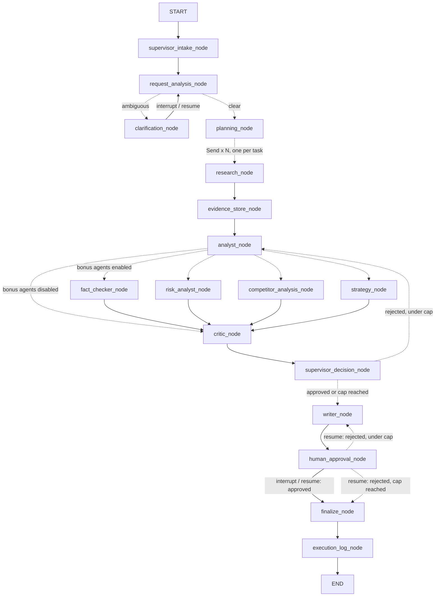

# Evident Backend

A production-grade, LangGraph-orchestrated backend for **Evident**, a
Multi-Agent Research & Decision Intelligence Platform. This is the backend
only — the existing React/Vite frontend in `../evident` is untouched.

## Quick start

```bash
cd backend
python -m venv .venv
.venv/Scripts/activate          # Windows; use `source .venv/bin/activate` on macOS/Linux
pip install -r requirements.txt

cp .env.example .env            # then fill in OPENAI_API_KEY or GEMINI_API_KEY
pytest -q                       # 52 tests, all hermetic — no network/API calls
python -m uvicorn app.main:app --reload --port 8000
```

Open `http://localhost:8000/docs` for the interactive API docs.

No API key configured yet? Every test in `tests/` stubs the LLM and every
network tool, so `pytest -q` works with zero configuration.

---

## 1. Folder architecture

```
backend/
  app/
    agents/        Agent logic (LLM calls + deterministic decisions). No LangGraph imports here.
    graph/
      nodes/        Thin async functions: state in, partial state out. Call agents/tools, build log entries.
      edges/         Conditional routing functions (pure functions of state) — fan-out, loops, gates.
      build_graph.py Wires nodes + edges into the compiled StateGraph.
    state/          The typed LangGraph state (TypedDict + reducers).
    schemas/        Every Pydantic model: requests, tasks, evidence, analysis, critic, handoffs, reports, API DTOs.
    services/       LLM provider abstraction, workflow orchestration, evidence store, execution trace compiler.
    tools/          Search, content extraction, evidence store/retrieval, markdown export, calculator,
                    citation validator, CSV reader, document reader.
    prompts/        One .md file per agent call — never hardcoded in Python. Loaded via string.Template.
    memory/         LangGraph checkpointer (MemorySaver) factory.
    models/         In-process run registry (run_id -> status, lock, initial state).
    api/
      routers/       One file per REST resource (research, clarification, workflow, tasks, evidence, logs, report, approval, health).
      middleware/     Request logging + centralized exception -> HTTP status mapping.
    config/          Settings (pydantic-settings) + structured logging setup.
    utils/           IDs, JSON repair, retry/backoff, custom exception hierarchy, time helpers.
    main.py         FastAPI app assembly.
  prompts/... (see app/prompts)
  logs/             Rotating structured log file (evident.log).
  reports/          Exported markdown reports, one per run_id.
  tests/            Mirrors the app/ structure: schemas, state, tools, agents, graph, API.
```

**Why this split:** `agents/` never imports LangGraph — an agent function is
just `async def do_thing(...) -> (result, LLMCallResult)`. That means every
agent is unit-testable with a stubbed LLM and no graph machinery at all
(see `tests/test_agents.py`). `graph/nodes/` is the only layer that knows
about `ResearchState`; it's a thin adapter between the graph and the agents.
`graph/edges/` is pure routing logic — every conditional edge is a plain
function of state, independently testable (see `tests/test_graph.py`).

---

## 2. The LangGraph workflow



This is the literal graph LangGraph compiles (verified by
`tests/test_graph.py::test_graph_compiles_with_expected_nodes`, and
reproducible yourself via
`get_compiled_graph().get_graph().draw_mermaid()`).

Every stage in the assignment's diagram maps to a real node:

| Diagram stage | Node(s) |
|---|---|
| Supervisor | `supervisor_intake_node`, `supervisor_decision_node` |
| Request Analysis | `request_analysis_node` |
| Clarification (conditional) | `clarification_node` |
| Dynamic Planning | `planning_node` |
| Parallel Research Tasks | `research_node` (fanned out via `Send`) |
| Evidence Store | `evidence_store_node` |
| Analyst | `analyst_node` |
| Critic | `critic_node` |
| Revision Loop | `supervisor_decision_node` <-> `analyst_node` |
| Report Writer | `writer_node` |
| Human Approval | `human_approval_node` |
| Final Report | `finalize_node` |
| Execution Log | `execution_log_node` |

---

## 3. State management

`app/state/graph_state.py` defines `ResearchState`, a `TypedDict` with two
categories of fields:

- **Sequential fields** (`research_objective`, `task_plan`, `analysis`,
  `final_report`, ...) — written by exactly one node at a time. Plain
  `TypedDict` entries; LangGraph's default overwrite-per-step is correct.
- **Concurrent/accumulating fields** (`evidence`, `execution_log`, `errors`,
  `bonus_insights`, `handoffs`, `critic_feedback`, `clarifications`) —
  `Annotated[list[T], operator.add]`, because multiple parallel branches
  (every fanned-out `research_node`, every bonus specialist) write to them
  in the same superstep. `completed_tasks` uses a custom
  `merge_unique_str` reducer instead of plain `operator.add` so a retried
  task can't be double-counted.

One sharp edge worth calling out (and the one bug the test suite actually
caught while building this): a field with **no** reducer can only be
written by **one** node per superstep. `updated_at` was originally written
by `research_node` for bookkeeping, but since `research_node` runs multiple
times concurrently (once per task), that violated the single-writer rule
and LangGraph raised `InvalidUpdateError`. Fix: bookkeeping-only fields are
only ever written by nodes that run alone in their superstep; the
concurrent nodes (`research_node`, the four bonus nodes) omit them and rely
on the sequential join node right after them (`evidence_store_node`,
`critic_node`) to refresh it.

State only ever holds Pydantic models and primitives — **never raw model
chain-of-thought** — satisfying the execution-trace requirement structurally,
not just by convention.

---

## 4. Agent communication

Every agent module (`app/agents/*.py`) exposes plain async functions that:

1. Render a prompt from `app/prompts/<agent>/*.md` via `render_prompt(...)`.
2. Call `LLMService.generate_structured(system_prompt, user_prompt, response_model)`.
3. Return `(parsed_pydantic_model, LLMCallResult)`.

`LLMService` (`app/services/llm_service.py`) is the single point where the
provider is chosen (OpenAI or Gemini, via `LLM_PROVIDER`), where JSON Schema
is appended to the prompt, and where the repair-retry loop lives: invalid
JSON or a schema mismatch feeds the specific error back to the model and
retries (bounded by `LLM_MAX_RETRIES`); transport failures (timeout, API
error) retry with exponential backoff. Both failure classes eventually
raise a typed `EvidentError` subclass that graph nodes catch and convert
into a recorded `WorkflowError` instead of crashing the run.

Context is deliberately narrow per agent: the Analyst gets the evidence
list rendered as compact one-line summaries (`agent_base.format_evidence_lines`),
not the full excerpt text; the Critic gets the Analyst's structured output,
not the raw evidence excerpts; the Writer gets the approved analysis +
evidence + bonus notes, not the full conversation history. No agent ever
receives the full accumulated state blob.

---

## 5. Handoffs

`app/schemas/handoff.py` defines one Pydantic envelope per transition named
in the assignment:

- `ResearchToAnalystHandoff` — evidence_ids, which research questions got
  covered vs. left open.
- `AnalystToCriticHandoff` — the full `AnalysisResult` + revision round.
- `CriticToSupervisorHandoff` — the `CriticFeedback` verdict.
- `SupervisorToWriterHandoff` — the approved analysis + feedback + the
  Supervisor's decision rationale.

Each is serialized (`.model_dump_json()`) and appended to the accumulating
`handoffs` state field at the point the transition actually happens
(`analyst_node`, `supervisor_decision_node`), so `GET /logs/{run_id}`
can show the exact handoff sequence for a run.

---

## 6. Parallel execution

Two independent fan-out/fan-in points, both using LangGraph's `Send` API:

1. **Research** (`fan_out_to_research` in `app/graph/edges/conditions.py`):
   `planning_node` produces a dynamic `task_plan`; the conditional edge
   returns one `Send("research_node", {...task...})` per task. Because
   every `research_node` Send shares the single downstream edge to
   `evidence_store_node`, LangGraph automatically waits for **all**
   task instances to finish before `evidence_store_node` runs — no manual
   join/barrier code needed.
2. **Bonus specialists** (`route_after_analyst`): when
   `ENABLE_BONUS_AGENTS=true`, the Analyst's single output fans out to
   Fact Checker, Risk Analyst, Competitor Analysis, and Strategy
   concurrently; all four share an edge back to `critic_node`, which is the
   join point.

---

## 7. Revision loop

`supervisor_decision_node` (deterministic Python, **no LLM call** — it must
be reliable and unit-testable, see `test_decide_after_critic_*` in
`tests/test_agents.py`) inspects the latest `CriticFeedback`:

- `verdict == approved` -> `advance_to_writer`.
- `verdict == rejected` and `revision_count < MAX_REVISION_CYCLES` (default
  2) -> `send_back_for_revision`, `revision_count += 1`, loop to
  `analyst_node` (which receives the Critic's `required_revisions` as extra
  prompt context).
- `revision_count >= MAX_REVISION_CYCLES` -> `advance_to_writer` anyway
  (terminate the loop, don't spin forever), and the caveat is preserved
  through to the report via the Critic's notes.

A second, independently-bounded loop exists at the human checkpoint: a
rejection from `POST /reject` sends the run back to `writer_node` **once**
(`MAX_HUMAN_REVISION_ROUNDS = 1` in `app/graph/nodes/writer_nodes.py`);
a second rejection finalizes the run as `rejected` rather than looping
forever.

---

## 8. Human checkpoints

Two points in the graph call LangGraph's `interrupt()`
(`langgraph.types.interrupt`), which pauses execution and persists the
pending value in the checkpointer (`MemorySaver`, thread-keyed by `run_id`):

- `clarification_node` — pauses with `{"type": "clarification_required",
  "question": ..., "round": ...}`. Resumed by `POST /clarification`, which
  calls `graph.ainvoke(Command(resume=answer), config)`.
- `human_approval_node` — pauses with `{"type": "approval_required",
  "report_title": ..., "executive_summary": ...}`. Resumed by
  `POST /approve` / `POST /reject`, which call
  `graph.ainvoke(Command(resume={"decision": ..., "feedback": ...}), config)`.

`GET /workflow/{run_id}` surfaces whichever interrupt is currently pending
(via `graph.get_state(config).tasks[i].interrupts`) so a client can render
the right prompt without guessing.

---

## 9. Failure recovery

| Failure mode | Where it's handled |
|---|---|
| Timeout | `LLMTimeoutError` (OpenAI/Gemini timeout), `tool_timeout_seconds` on every `httpx` call |
| Tool failure | `ToolExecutionError`; research continues with whatever sources succeeded |
| Search failure | `SearchFailureError`; task falls back to zero results -> Research Agent emits a `missing_information` evidence item instead of crashing |
| API failure | `LLMAPIError`, retried with backoff, then surfaced as a `WorkflowError` |
| Duplicate tasks | `supervisor_agent.build_task_plan` normalizes/dedupes `task_id`s after every planning call |
| Missing evidence | `MissingEvidenceError` available; Analyst/Critic degrade gracefully (empty evidence -> `unsupported_gaps`) rather than failing |
| Invalid JSON / invalid structured output | `LLMService`'s repair-retry loop (`app/utils/json_utils.py` + bounded retries) |
| Empty results | `EmptyResultError` available; empty search results are a normal (not exceptional) path throughout `research_agent.py` |
| Bonus agent failure | Caught per-node in `bonus_nodes.py` and logged as a `WorkflowError`; **never** fails the run — bonus agents are enhancements |
| Supervisor recovery | `supervisor_decision_node`'s revision-cap logic; `run_workflow`/`resume_with_*` in `workflow_service.py` catch any uncaught node exception, mark the run `failed`, and log it rather than crashing the process |

---

## 10. API structure

| Method | Path | Purpose |
|---|---|---|
| POST | `/research` | Start a new run (202, returns `run_id` immediately; graph runs in a `BackgroundTasks` task) |
| POST | `/clarification` | Answer a pending clarification question |
| GET | `/workflow/{run_id}` | Current status, pending clarification/approval, errors |
| GET | `/tasks/{run_id}` | Task plan with live-computed status (pending/in_progress/completed/failed) |
| GET | `/evidence/{run_id}` | All evidence collected so far |
| GET | `/logs/{run_id}` | Compiled `ExecutionTrace` (agents, tools, handoffs, errors, approvals, timing) |
| GET | `/report/{run_id}` | The draft or final report |
| POST | `/approve` | Approve the draft report -> finalize |
| POST | `/reject` | Reject the draft report -> bounded rewrite loop |
| GET | `/health` | Liveness + active run count |

All domain errors (`RunNotFoundError` -> 404, `InvalidWorkflowStateError` ->
409) are mapped centrally in `app/api/middleware/error_middleware.py`
rather than handled ad hoc per route.

---

## 11. Requirement checklist

- **Agents** — Supervisor (never researches), Research (fact/claim/
  assumption/missing-info distinction), Analyst (evidence-only), Critic
  (evaluates, never rewrites), Report Writer (evidence/recommendation kept
  separate), plus all four bonus agents (Fact Checker, Risk Analyst,
  Competitor Analysis, Strategy), gated by `ENABLE_BONUS_AGENTS`.
- **State** — every field from the spec's list is present in
  `ResearchState`, plus the extra fields Request Analysis needs
  (`deliverable`, `time_horizon`, `missing_information`, `entities`).
- **Request analysis** — `StructuredRequest` schema extracts exactly the
  seven fields asked for.
- **Clarification** — conditional `interrupt()`, resumable, capped by
  `MAX_CLARIFICATION_ROUNDS`.
- **Task planning** — fully LLM-derived (`supervisor/task_planning.md`),
  normalized for uniqueness/status in code, never hardcoded.
- **Parallel execution** — `Send`-based fan-out/fan-in, twice (research,
  bonus agents).
- **Tools** — search, content extraction, evidence store, evidence
  retrieval, markdown export, calculator, citation validator, CSV reader,
  document reader — all implemented, all real (no stubs).
- **Evidence model** — every field from the spec (`evidence_id`, `claim`,
  `supporting_text`, `source`, `source_title`, `retrieved_at`,
  `research_question`, `confidence`, `agent_id`) plus `task_id`.
- **Handoffs** — four structured envelopes, one per named transition.
- **Revision loop** — capped at 2, deterministic gate.
- **Context management** — narrow, role-specific prompts; no full-state
  dumps into any single agent call.
- **Failure handling** — see section 9 above; every named failure mode has
  a specific exception type and a specific recovery path.
- **Execution trace** — `ExecutionTrace` schema + `execution_trace_service.py`
  compile it from state on read; chain-of-thought is never stored anywhere.
- **FastAPI** — all nine endpoints from the spec, plus `/health`.
- **Project structure** — matches the requested tree (see section 1).
- **Prompts** — every prompt lives in `app/prompts/**/*.md`, loaded via
  `string.Template`, never hardcoded in Python.
- **Configuration** — `.env` via `pydantic-settings`; model, temperature,
  retries, timeouts, revision/clarification caps, bonus-agent toggle all
  configurable.
- **Logging** — structured (`structlog`, JSON), every agent and tool
  invocation logged with duration; rotating file handler under `logs/`.
- **Testing** — 52 tests across schemas, state/reducers, tools (including
  monkeypatched search/extraction), agents (with a scriptable fake LLM),
  graph routing + two full end-to-end graph runs (happy path,
  human-rejection loop, clarification loop), and the FastAPI layer
  end-to-end. All hermetic — zero network calls, zero API keys required.
