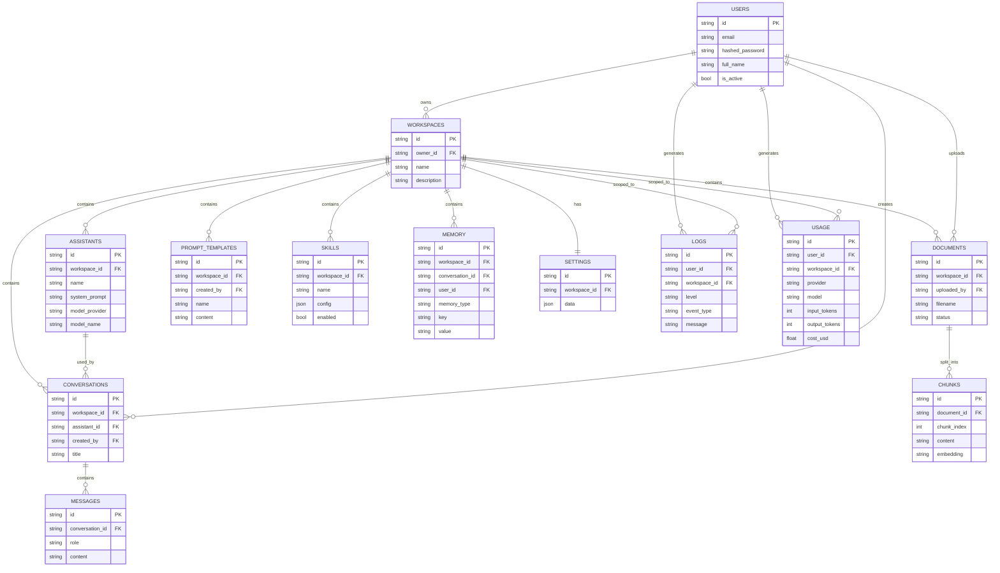

# Database Schema — Part 1

All primary keys are string UUIDs (portable across SQLite and Postgres). All tables have
`created_at`/`updated_at`. Foreign keys cascade delete downward from `workspaces` unless noted.

## ERD

## Isolation rule

Every workspace-scoped query filters by `Workspace.owner_id == current_user.id` at the ORM
level (not just via a route guard), so a guessed/enumerated ID can't leak another user's row.
See `app/api/routers/workspaces.py::_get_owned_workspace_or_404` and its test coverage in
`tests/integration/test_workspace_isolation.py`.

## SQLite -> Postgres/Supabase migration path

`Chunk.embedding` is `Text` (JSON-encoded) for now; it becomes a `pgvector` column with the
same name once `DATABASE_URL` points at Postgres — no other model changes required. No
SQLite-only types (native UUID, arrays) are used anywhere in the schema.
